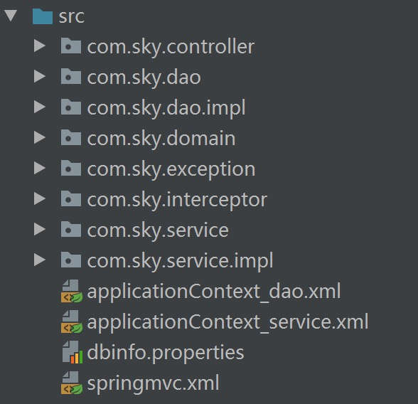

# SSH(Spring+SpringMVC+Hibernate)

 1.创建项目，导入jar(spring(15个)＋hibernate(11个)+上传包(2个)………….)

 2.导入页面资源jsp放入到WEB-INF/jsp目录下

3.以分层思想进行分包



## 第一章：以xml方式进行整合

#### 1.1 dao层相关：

#####     	1.1.1 dao层接口及实现类

```java
UserDao.java

public interface UserDao {
   public void insertUser(User user);
   public User queryUserByUserNameAndPwd(User user);
}
UserDaoImpl.java
public class UserDaoImpl extends HibernateDaoSupport
        implements UserDao {
    @Override
    public void insertUser(User user) {
        getHibernateTemplate().save(user);
    }
    @Override
    public User queryUserByUserNameAndPwd(User user) {
        DetachedCriteria criteria = DetachedCriteria.forClass(User.class);
        criteria.add(Restrictions.eq("user_name", user.getUser_name()));
        criteria.add(Restrictions.eq("user_pwd", user.getUser_pwd()));
        List<User> list =
                ( List<User>)getHibernateTemplate().findByCriteria(criteria);
       if (list!=null&&list.size()>0)
       {
           return  list.get(0);
       }
        return null;
    }
}

ShopDao.java

public interface ShopDao {
    public List<Shop> queryAllShopList();
    public Shop queryShopById(Integer shop_id);
    public void updateShop(Shop shop);
}
ShopDaoImpl.java
public class ShopDaoImpl extends HibernateDaoSupport implements ShopDao {
    @Override
    public List<Shop> queryAllShopList() {
        List<Shop> list= (List<Shop>)getHibernateTemplate().find("from com.sky.domain.Shop");
        return list;
    }
    @Override
    public Shop queryShopById(Integer shop_id) {
        return   getHibernateTemplate().get(Shop.class,shop_id);
    }
    @Override
    public void updateShop(Shop shop) {
     getHibernateTemplate().update(shop);
    }
}
```

#####    	1.1.2 配置文件(applicationContext_dao.xml)

```xml
dbinfo.properties如下：
      driverClass=com.mysql.jdbc.Driver
      jdbcUrl=jdbc:mysql://localhost:3306/ideaBySSH
      user=root
      password=123456

applicationContext_dao.xml如下：

<?xml version="1.0" encoding="UTF-8"?>
<beans xmlns="http://www.springframework.org/schema/beans"
       xmlns:xsi="http://www.w3.org/2001/XMLSchema-instance"
       xmlns:context="http://www.springframework.org/schema/context"
       xsi:schemaLocation="http://www.springframework.org/schema/beans
       http://www.springframework.org/schema/beans/spring-beans.xsd
       http://www.springframework.org/schema/context
	   http://www.springframework.org/schema/context/spring-context-4.3.xsd">

    <!--1.加载数据库的属性配置文件 -->
    <context:property-placeholder location="classpath:dbinfo.properties"></context:property-placeholder>
    <!-- 2.配置c3p0数据源 -->
    <bean name="ds" class="com.mchange.v2.c3p0.ComboPooledDataSource">
        <property name="driverClass" value="${driverClass}"></property>
        <property name="jdbcUrl" value="${jdbcUrl}"></property>
        <property name="user" value="${user}"></property>
        <property name="password" value="${password}"></property>
    </bean>
    <!-- 3.配置sessionFactory -->
    <bean name="sf"
          class="org.springframework.orm.hibernate5.LocalSessionFactoryBean">
        <!-- 3.1 注入数据源连接池信息 -->
        <property name="dataSource" ref="ds"></property>
        <!-- 3.2 hibernate的额外配置 (可选配置) -->
        <property name="hibernateProperties">
            <props>
                <!-- JBoss Tools 提示工具 -->
                <prop key="hibernate.dialect">org.hibernate.dialect.MySQL5InnoDBDialect</prop>
                <prop key="hibernate.show_sql">true</prop>
                <prop key="hibernate.format_sql">true</prop>
                <prop key="hibernate.hbm2ddl.auto">update</prop>
                <!-- 隔离级别 -->
                <prop key="hibernate.connection.isolation">4</prop>
                <!-- 目的：要使用getCurrentSession()获取当前线程绑定的Session，必须要做如下配置： 必须要使用Spring提供的SpringSessionContext -->
                <prop key="hibernate.current_session_context_class">org.springframework.orm.hibernate5.SpringSessionContext
                </prop>
            </props>
        </property>
        <!-- 3.3 加载映射文件(注解类型) -->
        <property name="packagesToScan" value="com.sky.domain"></property>
    </bean>
    <!-- 4.配置dao层对象，注入sessionFactory对象 -->
  <bean name="userDao" class="com.sky.dao.impl.UserDaoImpl">
    <property name="sessionFactory" ref="sf"></property>
</bean>
    <bean name="shopDao" class="com.sky.dao.impl.ShopDaoImpl">
        <property name="sessionFactory" ref="sf"></property>
    </bean>
</beans>
```

#### 1.2 service层相关：

##### 	1.2.1 service接口实现类

```java
UserService.java

public interface UserService {
    public  void register(User user);
    public  User loginUser(User user) ;
}

UserServiceImpl.java
//@Transactional
public class UserServiceImpl implements UserService {
    private UserDao userDao;
    public void setUserDao(UserDao userDao) {
        this.userDao = userDao;
    }
    @Override
    public void register(User user) {
        userDao.insertUser(user);
    }
    @Override
    public User loginUser(User user) {
       User user1 = userDao.queryUserByUserNameAndPwd(user);
       return user1;
    }
}

ShopService.java
public interface ShopService {
    public List<Shop> queryShopList();
    public Shop queryShopById(Integer shop_id);
    public void updateShop(Shop shop);
}

ShopServiceImpl.java
//@Transactional
public class ShopServiceImpl implements ShopService {
    private ShopDao shopDao;
    public void setShopDao(ShopDao shopDao) {
        this.shopDao = shopDao;
    }
    @Override
    public List<Shop> queryShopList() {
        return shopDao.queryAllShopList();
    }
    @Override
    public Shop queryShopById(Integer shop_id) {
        return shopDao.queryShopById(shop_id);
    }
    @Override
    public void updateShop(Shop shop) {
        shopDao.updateShop(shop);
    }
}
```

##### 	1.2.2 配置文件(applicationContext_service.xml)

```xml
<?xml version="1.0" encoding="UTF-8"?>
<beans xmlns:xsi="http://www.w3.org/2001/XMLSchema-instance"
       xmlns="http://www.springframework.org/schema/beans"
       xmlns:tx="http://www.springframework.org/schema/tx"
       xmlns:aop="http://www.springframework.org/schema/aop"
       xsi:schemaLocation="
    http://www.springframework.org/schema/aop
	http://www.springframework.org/schema/aop/spring-aop-4.3.xsd
	http://www.springframework.org/schema/tx
	http://www.springframework.org/schema/tx/spring-tx-4.3.xsd
	http://www.springframework.org/schema/beans
	http://www.springframework.org/schema/beans/spring-beans-4.3.xsd">
    <!--配置事务管理器-->
    <bean  name="htm" class="org.springframework.orm.hibernate5.HibernateTransactionManager">
        <property name="sessionFactory" ref="sf"></property>
    </bean>
  <!--XML配置事务-->
    <tx:advice transaction-manager="htm" id="txAdvice">
        <tx:attributes>
            <tx:method name="*" isolation="REPEATABLE_READ"
            read-only="false" propagation="REQUIRED"/>
        </tx:attributes>
    </tx:advice>
    
    <aop:config proxy-target-class="true">
    <aop:pointcut id="pt" expression="execution(* com.sky.service.impl.*ServiceImpl.*(..))"></aop:pointcut>
         <aop:advisor advice-ref="txAdvice" pointcut-ref="pt"></aop:advisor>
    </aop:config>

    <!--&lt;!&ndash;配置注解驱动&ndash;&gt;
    <tx:annotation-driven transaction-manager="htm"></tx:annotation-driven>
-->
    <bean name="userService" class="com.sky.service.impl.UserServiceImpl">
    <property name="userDao" ref="userDao"></property>
</bean>
    <bean name="shopService" class="com.sky.service.impl.ShopServiceImpl">
        <property name="shopDao" ref="shopDao"></property>
    </bean>
</beans>
```

#### 1.3 controller控制层类：

#####       1.2.1 UserController类

```java
@Controller
public class UserController {
    @Resource(name = "userService")
    private UserService userService;
    //跳转到注册页面
    @RequestMapping("/register.action")
    public String register() {
        return "user/register";
    }
    @RequestMapping("/doRegister.action")
    public String toDoRegister(HttpServletRequest request,
                               User user,
                               @RequestParam("picture") MultipartFile picture)
    throws  Exception{
       String imagePath= request.getRealPath("/WEB-INF/image");
       File file=new File(imagePath);
       if (!file.exists()){
           file.mkdirs();
       }
       //1.获取文件名
       String originalName = FilenameUtils.getName(picture.getOriginalFilename());
       System.out.println("=====originalName=====");
       // 2.设置图片名称，不能重复，可以使用uuid
       String uuid = UUID.randomUUID().toString();
       //3.上传
        picture.transferTo(new File(file,uuid + "_" + originalName));
        user.setUser_headimg(uuid + "_" + originalName);
        //5.打印网络地址进行测试是否成功显示图片
        System.out.println("http://localhost"+request.getContextPath() +"/image/"+ user.getUser_headimg());
        //6.调用业务逻辑
        userService.register(user);
        return "user/success";
    }
    @RequestMapping("/login.action")
    public String login() {
        return "user/login";
    }
    @RequestMapping("/dologin.action")
    public String tologin(User user, HttpSession httpSession) {
        User user1= userService.loginUser(user);
        httpSession.setAttribute("userInfo",user1);
        return "user/userinfo";
    }
}
```

#####       1.3.2  ShopController类

```java
@Controller
public class ShopController {
    @Resource(name = "shopService")
    private ShopService shopService;
    @RequestMapping("/shopList.action")
    public  String queryAllShopList(Model model){
        List<Shop> list= shopService.queryShopList();
        model.addAttribute("list",list);
        return "shop/itemList";
    }
    @RequestMapping("/itemEdit.action")
    public String findShopById(Integer id,Model model){
       Shop shop = shopService.queryShopById(id);
       model.addAttribute("shop",shop);
       return "/shop/editItem";
    }
    @RequestMapping("/updateitem.action")
    public String updateShop(Shop shop){
        System.out.print("==shop=="+shop);
       shopService.updateShop(shop);
        return "redirect:shopList.action";
    }
}
```

#### 1.4 springmvc的配置文件：

```xml
<?xml version="1.0" encoding="UTF-8"?>
<beans xmlns:xsi="http://www.w3.org/2001/XMLSchema-instance"
       xmlns:context="http://www.springframework.org/schema/context"
       xmlns="http://www.springframework.org/schema/beans"
       xmlns:mvc="http://www.springframework.org/schema/mvc"
       xsi:schemaLocation="
	http://www.springframework.org/schema/mvc
	http://www.springframework.org/schema/mvc/spring-mvc-4.3.xsd
	http://www.springframework.org/schema/beans
	http://www.springframework.org/schema/beans/spring-beans-4.3.xsd
	http://www.springframework.org/schema/context
	http://www.springframework.org/schema/context/spring-context-4.3.xsd">
    <!--1.扫描SpringMVC的注解@Controller  -->
    <context:component-scan base-package="com.sky.controller">
        <context:include-filter type="annotation"
                                expression="org.springframework.stereotype.Controller" />
        <context:include-filter type="annotation"                              									expression="org.springframework.web.bind.annotation.ControllerAdvice" />
    </context:component-scan>
    <!--2.配置处理器 (RequestMappingHandlerMapping,RequestMappingHandlerAdapter)-->
    <mvc:annotation-driven></mvc:annotation-driven>
    <!--3.放行静态资源-->
    <mvc:default-servlet-handler></mvc:default-servlet-handler>
    <mvc:resources mapping="/image/**" location="/WEB-INF/image/"></mvc:resources>
    <!--<mvc:resources mapping="/js/**" location="/WEB-INF/js/"></mvc:resources>
    <mvc:resources mapping="/css/**" location="/WEB-INF/css/"></mvc:resources>
-->
    <!--配置视图解析器-->
    <bean class="org.springframework.web.servlet.view.InternalResourceViewResolver">
        <property name="prefix" value="/WEB-INF/jsp/"></property>
        <property name="suffix" value=".jsp"></property>
    </bean>
    <!--配置上传解析器-->
    <bean name="multipartResolver" class="org.springframework.web.multipart.commons.CommonsMultipartResolver">
        <property name="maxUploadSize" value="5000000"></property>
    </bean> 
    <!--配置拦截器-->
    <mvc:interceptors>
        <mvc:interceptor>
            <!-- 所有请求都进入拦截器 -->
            <mvc:mapping path="/*"/>
            <!--配置具体的拦截器 -->
            <bean class="com.sky.interceptor.LoginInterceptor"></bean>
        </mvc:interceptor>
    </mvc:interceptors>
</beans>
```

#### 1.5 web.xml配置：

```XML
<?xml version="1.0" encoding="UTF-8"?>
<web-app xmlns="http://xmlns.jcp.org/xml/ns/javaee"
         xmlns:xsi="http://www.w3.org/2001/XMLSchema-instance"
         xsi:schemaLocation="http://xmlns.jcp.org/xml/ns/javaee http://xmlns.jcp.org/xml/ns/javaee/web-app_3_1.xsd"
         version="3.1">
    <!--加载Spring配置文件-->
    <listener>
        <listener-class>org.springframework.web.context.ContextLoaderListener</listener-class>
    </listener>
    <context-param>
        <param-name>contextConfigLocation</param-name>
        <param-value>classpath*:applicationContext_*.xml</param-value>
    </context-param>
    <!--加载SpringMVC前端控制器DispatcherServlet-->
    <servlet>
        <servlet-name>dispatcherServlet</servlet-name>
        <servlet-class>org.springframework.web.servlet.DispatcherServlet</servlet-class>
        <init-param>
            <param-name>contextConfigLocation</param-name>
            <param-value>classpath*:springmvc.xml</param-value>
        </init-param>
        <load-on-startup>1</load-on-startup>
    </servlet>
    <servlet-mapping>
        <servlet-name>dispatcherServlet</servlet-name>
        <!--拦截所有，唯独放行jsp-->
        <url-pattern>/</url-pattern>
    </servlet-mapping>
    <!-- 表单提交过滤请求，防止中文乱码 -->
    <filter>
        <filter-name>encoding</filter-name>
        <filter-class>org.springframework.web.filter.CharacterEncodingFilter</filter-class>
        <init-param>
            <param-name>encoding</param-name>
            <param-value>UTF-8</param-value>
        </init-param>
    </filter>
    <filter-mapping>
        <filter-name>encoding</filter-name>
        <url-pattern>/*</url-pattern>
    </filter-mapping>
</web-app>
```

## 第二章：以注解方式进行整合

#### 1.1 dao层相关：

#####     	1.1.1 dao层接口及实现类

```java
UserDao.java

public interface UserDao {
   public void insertUser(User user);
   public User queryUserByUserNameAndPwd(User user);
}
UserDaoImpl.java
@Repository
public class UserDaoImpl extends HibernateDaoSupport
        implements UserDao {
    @Resource(name = "sessionFactory")
    public void setSessionFactoryOverride(SessionFactory sessionFactory)
    {
        super.setSessionFactory(sessionFactory);
    }
    @Override
    public void insertUser(User user) {
        getHibernateTemplate().save(user);
    }
    @Override
    public User queryUserByUserNameAndPwd(User user) {
        DetachedCriteria criteria = DetachedCriteria.forClass(User.class);
        criteria.add(Restrictions.eq("user_name", user.getUser_name()));
        criteria.add(Restrictions.eq("user_pwd", user.getUser_pwd()));
        List<User> list =
                ( List<User>)getHibernateTemplate().findByCriteria(criteria);
        if (list!=null&&list.size()>0)
        {
            return  list.get(0);
        }
        return null;
    }
}

ShopDao.java

public interface ShopDao {
    public List<Shop> queryAllShopList();
    public Shop queryShopById(Integer shop_id);
    public void updateShop(Shop shop);
}
ShopDaoImpl.java
@Repository
public class ShopDaoImpl extends HibernateDaoSupport implements ShopDao {
    @Resource(name = "sessionFactory")
    public void setSessionFactoryOverride(SessionFactory sessionFactory)
    {
        super.setSessionFactory(sessionFactory);
    }
    @Override
    public List<Shop> queryAllShopList() {
        List<Shop> list= (List<Shop>)getHibernateTemplate().find("from com.sky.domain.Shop");
        return list;
    }
    @Override
    public Shop queryShopById(Integer shop_id) {
        return   getHibernateTemplate().get(Shop.class,shop_id);

    }
    @Override
    public void updateShop(Shop shop) {
     getHibernateTemplate().update(shop);
    }
}
```

#####    	1.1.2 配置文件(applicationContext_dao.xml)

```xml
dbinfo.properties如下：
      driverClass=com.mysql.jdbc.Driver
      jdbcUrl=jdbc:mysql://localhost:3306/ideaBySSH
      user=root
      password=123456

applicationContext_dao.xml如下：
<?xml version="1.0" encoding="UTF-8"?>
<beans xmlns="http://www.springframework.org/schema/beans"
       xmlns:xsi="http://www.w3.org/2001/XMLSchema-instance"
       xmlns:context="http://www.springframework.org/schema/context"
       xsi:schemaLocation="http://www.springframework.org/schema/beans
       http://www.springframework.org/schema/beans/spring-beans.xsd
       http://www.springframework.org/schema/context
	   http://www.springframework.org/schema/context/spring-context-4.3.xsd">

    <!--1.加载数据库的属性配置文件 -->
    <!--1.加载数据库的属性配置文件 -->
    <context:property-placeholder location="classpath:dbinfo.properties"></context:property-placeholder>
    <!-- 2.配置c3p0数据源 -->
    <bean name="ds" class="com.mchange.v2.c3p0.ComboPooledDataSource">
        <property name="driverClass" value="${driverClass}"></property>
        <property name="jdbcUrl" value="${jdbcUrl}"></property>
        <property name="user" value="${user}"></property>
        <property name="password" value="${password}"></property>
    </bean>
    <!-- 3.配置sessionFactory -->
    <bean name="sessionFactory"
          class="org.springframework.orm.hibernate5.LocalSessionFactoryBean">
        <!-- 3.1 注入数据源连接池信息 -->
        <property name="dataSource" ref="ds"></property>
        <!-- 3.2 hibernate的额外配置 (可选配置) -->
        <property name="hibernateProperties">
            <props>
                <!-- JBoss Tools 提示工具 -->
                <prop key="hibernate.dialect">org.hibernate.dialect.MySQL5InnoDBDialect</prop>
                <prop key="hibernate.show_sql">true</prop>
                <prop key="hibernate.format_sql">true</prop>
                <prop key="hibernate.hbm2ddl.auto">update</prop>
                <!-- 隔离级别 -->
                <prop key="hibernate.connection.isolation">4</prop>
                <!-- 目的：要使用getCurrentSession()获取当前线程绑定的Session，必须要做如下配置： 必须要使用Spring提供的SpringSessionContext -->
                <prop key="hibernate.current_session_context_class">org.springframework.orm.hibernate5.SpringSessionContext
                </prop>
            </props>
        </property>
        <!-- 3.3 加载映射文件(注解类型) -->
        <property name="packagesToScan" value="com.sky.domain"></property>
    </bean>
  <!--扫描Spring注解@Repository-->
    <context:component-scan base-package="com.sky.dao">
    </context:component-scan>
</beans>
```

#### 1.2 service层相关：

##### 	1.2.1 service接口实现类

```java
UserService.java

public interface UserService {
    public  void register(User user);
    public  User loginUser(User user) ;
}

UserServiceImpl.java
//@Transactional
public class UserServiceImpl implements UserService {
    private UserDao userDao;
    public void setUserDao(UserDao userDao) {
        this.userDao = userDao;
    }
    @Override
    public void register(User user) {
        userDao.insertUser(user);
    }
    @Override
    public User loginUser(User user) {
       User user1 = userDao.queryUserByUserNameAndPwd(user);
       return user1;
    }
}

ShopService.java
public interface ShopService {
    public List<Shop> queryShopList();
    public Shop queryShopById(Integer shop_id);
    public void updateShop(Shop shop);
}

ShopServiceImpl.java
//@Transactional
public class ShopServiceImpl implements ShopService {
    private ShopDao shopDao;
    public void setShopDao(ShopDao shopDao) {
        this.shopDao = shopDao;
    }
    @Override
    public List<Shop> queryShopList() {
        return shopDao.queryAllShopList();
    }
    @Override
    public Shop queryShopById(Integer shop_id) {
        return shopDao.queryShopById(shop_id);
    }
    @Override
    public void updateShop(Shop shop) {
        shopDao.updateShop(shop);
    }
}
```

##### 	1.2.2 配置文件(applicationContext_service.xml)

```xml
<?xml version="1.0" encoding="UTF-8"?>
<beans xmlns:xsi="http://www.w3.org/2001/XMLSchema-instance"
       xmlns="http://www.springframework.org/schema/beans"
       xmlns:tx="http://www.springframework.org/schema/tx"
       xmlns:context="http://www.springframework.org/schema/context"
       xsi:schemaLocation="http://www.springframework.org/schema/beans
       http://www.springframework.org/schema/beans/spring-beans.xsd
       http://www.springframework.org/schema/context
	   http://www.springframework.org/schema/context/spring-context-4.3.xsd
       http://www.springframework.org/schema/tx
	   http://www.springframework.org/schema/tx/spring-tx-4.3.xsd">

    <!--1.加载数据库的属性配置文件 -->
    <!--配置事务管理器-->
    <bean  name="htm" class="org.springframework.orm.hibernate5.HibernateTransactionManager">
        <property name="sessionFactory" ref="sessionFactory"></property>
    </bean>
    <!--&lt;!&ndash;配置注解驱动&ndash;&gt;-->
    <tx:annotation-driven transaction-manager="htm"></tx:annotation-driven>
      <!--扫描Spring注解@Service-->
    <context:component-scan base-package="com.sky.service">
    </context:component-scan>
</beans>
```

#### 1.3 controller控制层类：

#####       1.2.1 UserController类

```java
@Controller
public class UserController {
    @Resource(name = "userService")
    private UserService userService;
    //跳转到注册页面
    @RequestMapping("/register.action")
    public String register() {
        return "user/register";
    }
    @RequestMapping("/doRegister.action")
    public String toDoRegister(HttpServletRequest request,
                               User user,
                               @RequestParam("picture") MultipartFile picture)
    throws  Exception{
       String imagePath= request.getRealPath("/WEB-INF/image");
       File file=new File(imagePath);
       if (!file.exists()){
           file.mkdirs();
       }
       //1.获取文件名
       String originalName = FilenameUtils.getName(picture.getOriginalFilename());
       System.out.println("=====originalName=====");
       // 2.设置图片名称，不能重复，可以使用uuid
       String uuid = UUID.randomUUID().toString();
       //3.上传
        picture.transferTo(new File(file,uuid + "_" + originalName));
        user.setUser_headimg(uuid + "_" + originalName);
        //5.打印网络地址进行测试是否成功显示图片
        System.out.println("http://localhost"+request.getContextPath() +"/image/"+ user.getUser_headimg());
        //6.调用业务逻辑
        userService.register(user);
        return "user/success";
    }
    @RequestMapping("/login.action")
    public String login() {
        return "user/login";
    }
    @RequestMapping("/dologin.action")
    public String tologin(User user, HttpSession httpSession) {
        User user1= userService.loginUser(user);
        httpSession.setAttribute("userInfo",user1);
        return "user/userinfo";
    }
}
```

#####       1.3.2  ShopController类

```java
@Controller
public class ShopController {
    @Resource(name = "shopService")
    private ShopService shopService;
    @RequestMapping("/shopList.action")
    public  String queryAllShopList(Model model){
        List<Shop> list= shopService.queryShopList();
        model.addAttribute("list",list);
        return "shop/itemList";
    }
    @RequestMapping("/itemEdit.action")
    public String findShopById(Integer id,Model model){
       Shop shop = shopService.queryShopById(id);
       model.addAttribute("shop",shop);
       return "/shop/editItem";
    }
    @RequestMapping("/updateitem.action")
    public String updateShop(Shop shop){
        System.out.print("==shop=="+shop);
       shopService.updateShop(shop);
        return "redirect:shopList.action";
    }
}
```

#### 1.4 springmvc的配置文件：

```xml
<?xml version="1.0" encoding="UTF-8"?>
<beans xmlns:xsi="http://www.w3.org/2001/XMLSchema-instance"
       xmlns:context="http://www.springframework.org/schema/context"
       xmlns="http://www.springframework.org/schema/beans"
       xmlns:mvc="http://www.springframework.org/schema/mvc"
       xsi:schemaLocation="
	http://www.springframework.org/schema/mvc
	http://www.springframework.org/schema/mvc/spring-mvc-4.3.xsd
	http://www.springframework.org/schema/beans
	http://www.springframework.org/schema/beans/spring-beans-4.3.xsd
	http://www.springframework.org/schema/context
	http://www.springframework.org/schema/context/spring-context-4.3.xsd">
    <!--1.扫描SpringMVC的注解@Controller  -->
    <context:component-scan base-package="com.sky.controller">
    </context:component-scan>
    <!--2.配置处理器 (RequestMappingHandlerMapping,RequestMappingHandlerAdapter)-->
    <mvc:annotation-driven></mvc:annotation-driven>
    <!--3.放行静态资源-->
    <mvc:default-servlet-handler></mvc:default-servlet-handler>
    <mvc:resources mapping="/image/**" location="/WEB-INF/image/"></mvc:resources>
    <!--配置视图解析器-->
    <bean class="org.springframework.web.servlet.view.InternalResourceViewResolver">
        <property name="prefix" value="/WEB-INF/jsp/"></property>
        <property name="suffix" value=".jsp"></property>
    </bean>

    <!--配置上传解析器-->
    <bean name="multipartResolver" class="org.springframework.web.multipart.commons.CommonsMultipartResolver">
        <property name="maxUploadSize" value="5000000"></property>
    </bean>
    <!--配置拦截器-->
    <mvc:interceptors>
        <mvc:interceptor>
            <!-- 所有请求都进入拦截器 -->
            <mvc:mapping path="/*"/>
            <!--配置具体的拦截器 -->
            <bean class="com.sky.interceptor.LoginInterceptor"></bean>
        </mvc:interceptor>
    </mvc:interceptors>
</beans>
```

#### 1.5 web.xml配置：

```XML
<?xml version="1.0" encoding="UTF-8"?>
<web-app xmlns="http://xmlns.jcp.org/xml/ns/javaee"
         xmlns:xsi="http://www.w3.org/2001/XMLSchema-instance"
         xsi:schemaLocation="http://xmlns.jcp.org/xml/ns/javaee http://xmlns.jcp.org/xml/ns/javaee/web-app_3_1.xsd"
         version="3.1">
    <!--加载Spring配置文件-->
    <listener>
        <listener-class>org.springframework.web.context.ContextLoaderListener</listener-class>
    </listener>
    <context-param>
        <param-name>contextConfigLocation</param-name>
        <param-value>classpath*:applicationContext_*.xml</param-value>
    </context-param>
    <!--加载SpringMVC前端控制器DispatcherServlet-->
    <servlet>
        <servlet-name>dispatcherServlet</servlet-name>
        <servlet-class>org.springframework.web.servlet.DispatcherServlet</servlet-class>
        <init-param>
            <param-name>contextConfigLocation</param-name>
            <param-value>classpath*:springmvc.xml</param-value>
        </init-param>
        <load-on-startup>1</load-on-startup>
    </servlet>
    <servlet-mapping>
        <servlet-name>dispatcherServlet</servlet-name>
        <!--拦截所有，唯独放行jsp-->
        <url-pattern>/</url-pattern>
    </servlet-mapping>
    <!-- 表单提交过滤请求，防止中文乱码 -->
    <filter>
        <filter-name>encoding</filter-name>
        <filter-class>org.springframework.web.filter.CharacterEncodingFilter</filter-class>
        <init-param>
            <param-name>encoding</param-name>
            <param-value>UTF-8</param-value>
        </init-param>
    </filter>
    <filter-mapping>
        <filter-name>encoding</filter-name>
        <url-pattern>/*</url-pattern>
    </filter-mapping>
</web-app>
```